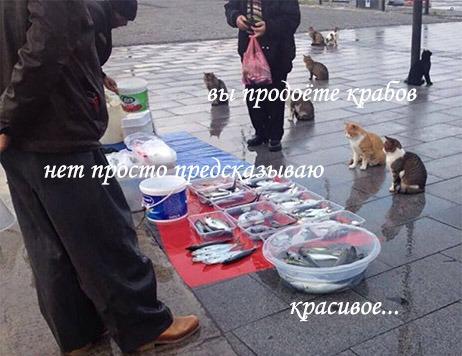

# Домашнее задание - 10. Streamlit

## Предсказываем возраст краба!

Приложение: https://eto-enot-ds-start-10-app-fea88h.streamlit.app/

Датасет взят из соревнования: https://www.kaggle.com/competitions/playground-series-s3e16

Датасет содержит следующую информацию о крабах, по которой необходимо предсказать его возраст:

- **Sex** - пол (самец, самка, неопределено)
- **Length** - длина
- **Diameter** - диаметр
- **Height** - высота
- **Weight** - масса
- **Shucked Weight** - масса без панциря
- **Viscera Weight** - масса внутренностей
- **Shell Weight** - масса панциря

Для предсказания используется простая модель линейной регрессии, обученная на этом датасете.

Автор: https://stepik.org/users/2437730/profile

